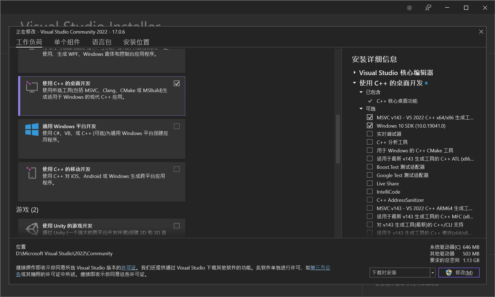
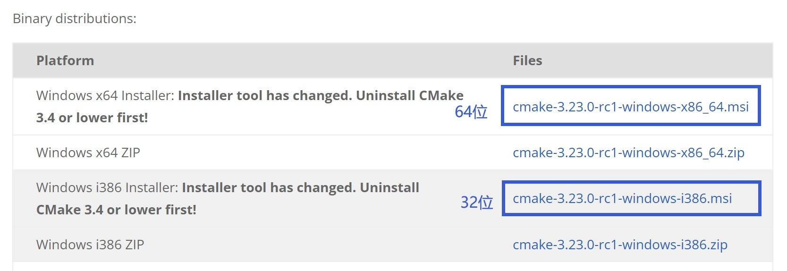
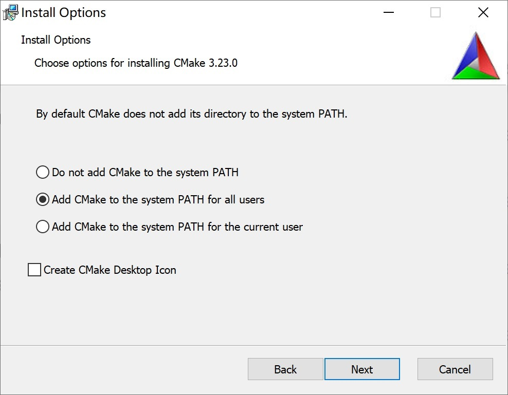
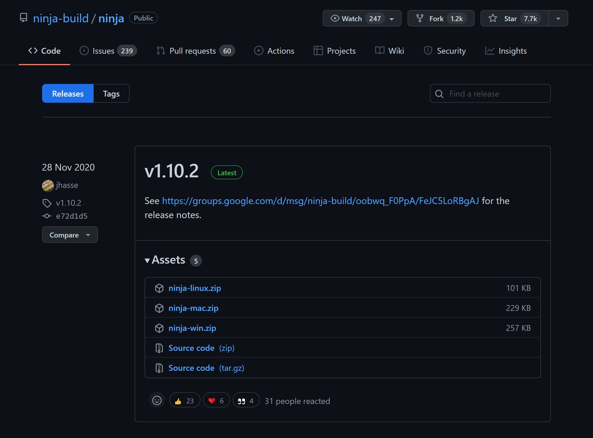
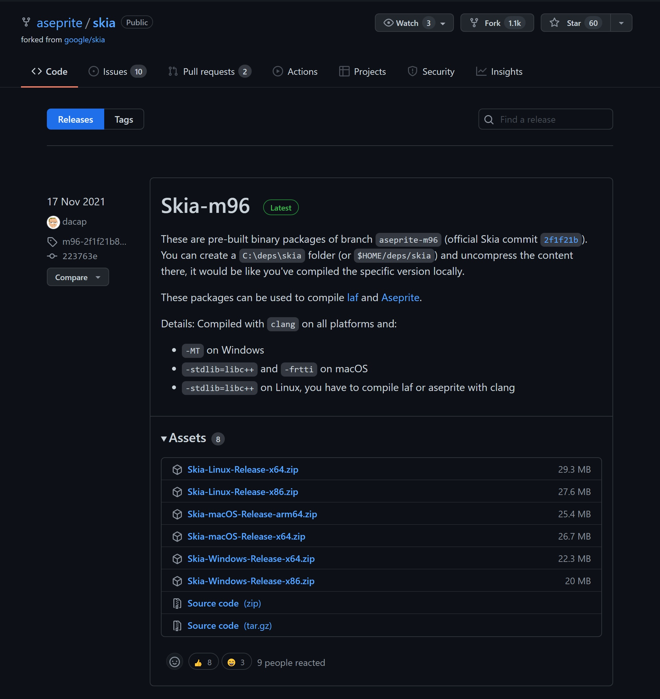
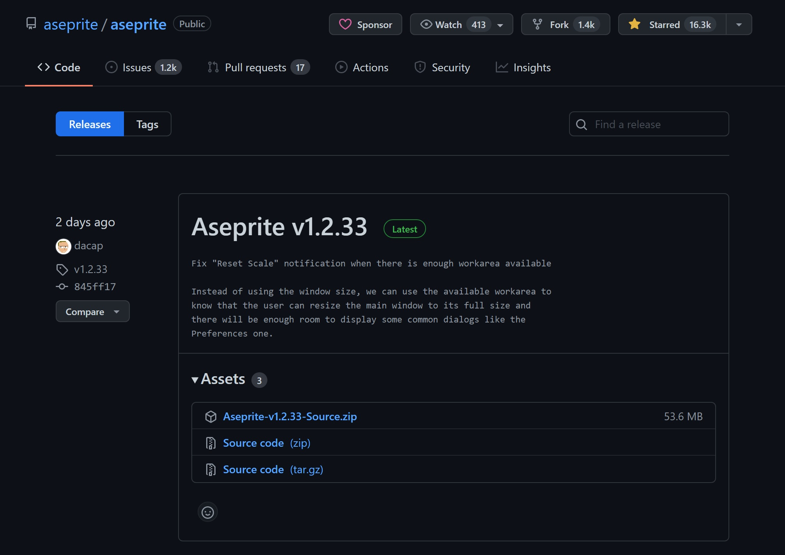

最近学 unity，想自己画点像素画，就去找了找有什么好用的像素画软件。首先就想到了大名鼎鼎的 Aseprite，去 Steam 上搜了下，70RMB。

对于穷学生党来说 70 也不少了（）何况我不久前才收了一台米板2，目前处于囊中羞涩的状态。搜索一番发现 Aseprite 居然是在 GitHub 上开源的（收费软件开源第一次见），官方 repo 里也提供了编译说明，遂自行编译之。

本文仅涉及 Windows 平台下的编译，若是 macOS 或是 Linux 平台可自行查看[官方编译说明](https://github.com/aseprite/aseprite/blob/main/INSTALL.md)（方法大同小异，甚至更简单，因为不用装VS）

平台：Windows 10（11理论上也行，可自行尝试）

# 准备工作
## 安装 Visual Studio 2019+
Windows 下的编译需要用到 Visual Studio Community （微软的IDE）的 2019 或以上的版本，我使用的是 VS2022

前往 [Visual Studio Downloads](https://visualstudio.microsoft.com/zh-hans/downloads/) 下载社区版


下载完成打开安装程序，选择 “使用 C++ 的桌面开发”，并在右侧**至少**勾选 “MSVC C++ x64/x86 生成工具” 和 “Windows 10 SDK”，然后点击安装。



## 安装 Cmake
前往 [Cmake 官网](https://cmake.org/download/)，在下方的 Binary distributions 中找到最新的 msi 安装文件并下载。



安装时选择第二个或者第三个就不用自己配置环境变量：



记下 Cmake 的安装目录，稍后会用到。

> Aseprite 编译不支持 MinGW，所以对于 MinGW 用户，需要将环境变量中的 MinGW 删除。

## 安装 Ninja
前往 [Ninja Releases](https://github.com/ninja-build/ninja/releases) 下载 `ninja-win.zip`



打开 Cmake 的安装目录，并把 `ninja-win.zip` 中的 `ninja.exe` 解压到 `<Cmake安装目录>\bin` 下

## 下载 Skia-m96
前往 [Skia Releases](https://github.com/aseprite/skia/releases) 根据系统位数下载 `Skia-Windows-Release.zip`，我的系统是 64 位的所以下载 x64 版本。
注意下载的是 **m96** 版本，不要下错了。



下载完解压好，记下位置，放在一旁备用。

# 编译 Aseprite
## 下载 Aseprite 源码
前往 [Aseprite Releases](https://github.com/aseprite/aseprite/releases) 下载 `Aseprite-<version>-Source.zip` 并解压，会使用 git 的也可以直接克隆仓库 `https://github.com/aseprite/aseprite.git`



## 开始编译
在开始菜单的 Visual Studio 文件夹里找到 x64 Native Tools Command Prompt for VS（32 位打开 x86）


初始化完成后输入 `cd <Aseprite源码目录>` 切换到源码目录下，如果在另一个分区则需要先用 `<盘符>:` 切换。如默认打开了 `D:\Microsoft Visual Studio\2022\Community`，而我的源码在 `C:\Users\b1acksoil\Downloads\Aseprite-Source` 里：
```
C:
cd C:\Users\b1acksoil\Downloads\Aseprite-Source
```

依次输入以下命令，第三条命令中将尖括号的内容（包括尖括号）替换为刚刚下载 Skia 解压后的文件夹：
```
mkdir build
cd build
cmake -DCMAKE_BUILD_TYPE=RelWithDebInfo -DLAF_BACKEND=skia -DSKIA_DIR="<Skia目录>" -DSKIA_LIBRARY_DIR="<Skia目录>\out\Release-x64" -DSKIA_LIBRARY="<Skia目录>\out\Release-x64\skia.lib" -G Ninja ..
```

随后等待第一段编译，时间取决于你的电脑性能。结束后输入：
```
ninja aseprite
```
期间最好不要做其他事情，性能差的电脑可以把后台清一清，否则可能会卡到一半。可以开个任务管理器看看，编译很占CPU，如果CPU占用突然下去了并且命令行长时间不动了，就是卡住了，使用 `Ctrl+C` 终止，输入 `cd ..`，删除 Aseprite 源码下的 build 文件夹再重试一次。

完成后可以在 Aseprite 源码下的 build 文件夹内找到 bin 文件夹，可以重命名并移动到其他地方，里面的 `aseprite.exe` 就是编译好的 Aseprite 主程序了。此时可以右键 `aseprite.exe`，并 发送到 > 桌面快捷方式。

## （可选）汉化
Aseprite 默认不含中文，但可以使用社区自制的中文汉化包。可以前往 [README](https://github.com/J-11/Aseprite-Simplified-Chinese/blob/master/README.md) 查看并下载。

## 更新
如果 Aseprite 有更新，手动编译相比直接在 Steam 购买还是有一些缺陷的，只能重新编译。下载新版的源码，按照上面流程再来一遍即可，麻烦是麻烦了点，但是可以白嫖还要什么自行车呢（
